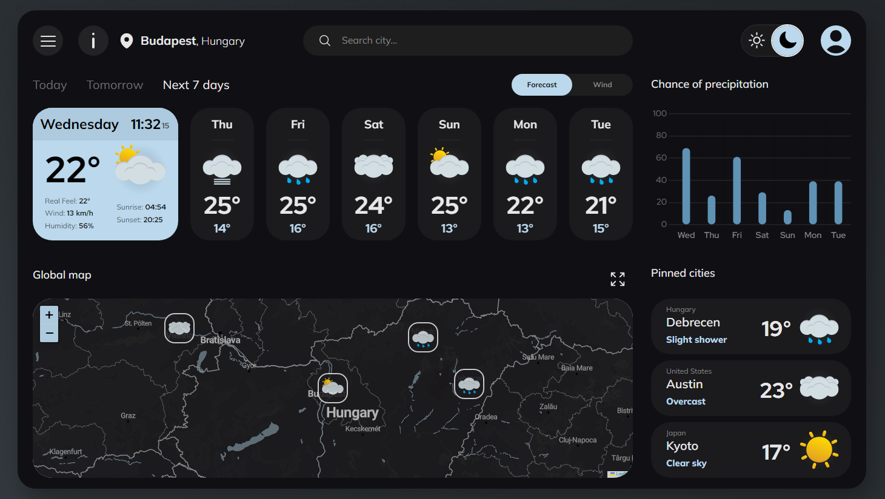
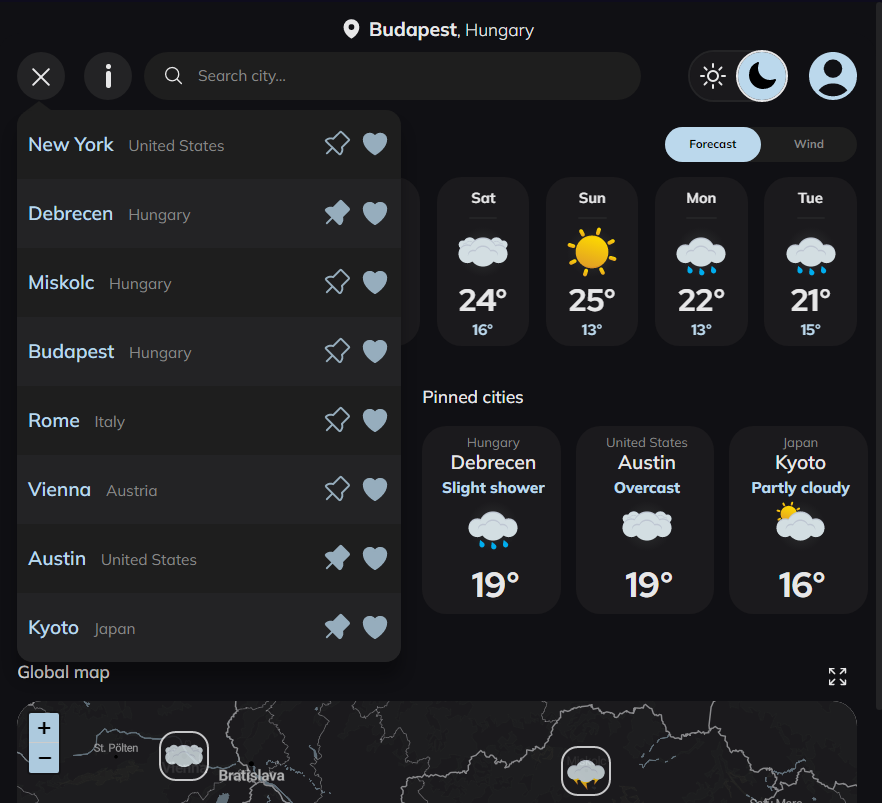

# Weathery - Your Personal Weather Guide

Welcome to Weathery, your ultimate companion for accurate and up-to-date weather forecasts. With Weathery, you can effortlessly stay informed about the weather conditions that matter most to you, ensuring you're always prepared for the day ahead.

## Development Information

- **Solo Project**: I worked on this project alone, taking on various roles from ideation to implementation. Being the sole contributor allowed me to take full ownership and bring my vision to life.

- **Time Invested**: Completing this project took approximately 160 hours of dedicated effort. Throughout the development process, I continuously iterated and refined the application to ensure a high-quality user experience.

- **Learning Journey**: This project has been a significant learning experience for me. I've gained valuable insights into data integration, API usage, user interface design, and more. It has been a journey of exploration and growth as a developer.

- **Portfolio Showcase**: I believe this project will bring color to my portfolio, showcasing my skills and dedication. It reflects my commitment to delivering functional and visually appealing applications that provide value to users.

- **Time Frame**: It took approximately 2 months to complete this project. The timeline allowed for thorough development, testing, and refinement, ensuring a polished and reliable weather forecast application.

## Features

1. **Intuitive City Search**: With Weathery's intelligent city search feature, finding weather information for any location is a breeze. Simply start typing the name of your desired city, and Weathery will provide instant autocomplete suggestions, saving you time and effort.

2. **Wind Information**: Stay informed about the direction and speed of the wind to better plan your outdoor activities.

3. **Personalized Favorites**: Create your personalized list of favorite cities on Weathery. Whether it's your hometown, dream vacation spot, or frequent travel destinations, add them to your favorites for quick and convenient access to their weather updates. Weathery is all about making the weather experience tailored to your preferences.

4. **Easy Pinning**: Pinning cities on Weathery ensures that your most important locations are always within reach. By pinning a city, you can effortlessly access its weather details without the need for repeated searches. Stay updated on the weather conditions of your pinned cities at a glance.

5. **Interactive Map**: Explore the world's weather patterns with Weathery's interactive map. Simply click on any location on the map, and instantly load the weather information for that specific area. It's a visually engaging way to discover weather trends across different regions and plan your trips accordingly.

6. **Map Pins**: When you add a city to your favorites, a weather icon pin is automatically placed on the map at the corresponding location. These icons are dynamically updated in real-time. This feature allows you to instantly see the current weather conditions for your favorite cities directly on the map.

7. **Precipitation Probability Chart**: Weathery's comprehensive precipitation probability chart helps you plan your activities effectively. With a quick glance, you can assess the likelihood of rain or other forms of precipitation over a specified time period, allowing you to make informed decisions and stay one step ahead of the weather.

8. **Light Mode**: With a clean and bright interface, Light Mode offers a refreshing visual aesthetic, ensuring a pleasant and comfortable browsing experience. Switching is easy. With just a click, you can toggle between Light Mode and Dark Mode, adapting the interface to match your mood or environment.

9. **Responsive Design**: Weathery is built with a responsive design, ensuring a seamless weather experience across all devices and screen sizes. Whether you're accessing the website from a desktop, laptop, tablet, or smartphone, Weathery adapts effortlessly to provide you with a consistent and user-friendly interface.

## Screenshots

## Technologies Used

- **HTML** is the backbone of this project, providing the structure and layout for Weathery with _semantic_ tags

- **SCSS** is utilized to enhance the styling capabilities of CSS, allowing for more efficient and maintainable styling code. The project follows the 7-1 file structure for organizing files, providing a logical and scalable approach to managing stylesheets.

- **Vanilla JavaScript** with **MVC Structure**: This architecture promotes a separation of concerns, allowing for modular development and maintainability. JavaScript handles the retrieval of weather data from external APIs, data manipulation, and dynamic updates on the user interface, following the MVC pattern.

## APIs Used

Weathery utilizes the following APIs to provide accurate and reliable weather information:

- **[Open-Meteo API](https://open-meteo.com/)** is used to fetch real-time forecast weather data for various locations. It provides detailed weather information, including temperature, humidity, wind speed, and more.

- **[Geoapify API](https://www.geoapify.com/)** is used for reverse geocoding and city name autocompletion features in Weathery. It enables the application to convert geographic coordinates into human-readable addresses and provides autocomplete suggestions for city names.
- **[Leaflet](https://leafletjs.com/)** library is utilized to provide an interactive and visually appealing map, and markers.
- **[Jawg API](https://www.jawg.io/)** is utilized for custom map styling in Weathery. It offers a range of map styles that enhance the visual experience and provide a unique look and feel to the application's maps.

## Future Enhancements

- Add support for multiple languages and units of measurement to cater to a diverse user base.
- Enhance the user interface with additional animations, themes, and interactive elements to improve the overall user experience.

Contributions and suggestions are welcome! Feel free to fork this repository, make changes, and submit a pull request to contribute to the project's growth.

## Contact Information

If you have any questions, suggestions, or feedback, feel free to reach out:

- Email: [horanszkipatrik@gmail.com](mailto:horanszkipatrik@gmail.com)
- Twitter: [@hptrk0916](https://twitter.com/hptrk0916)
- GitHub: [hptrk](https://github.com/hptrk)
- Discord: [hptrk#9820](https://discord.com/)
